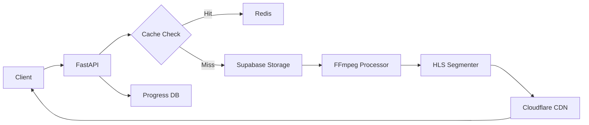

# 라디오 오디오 재생 API 설계 문서

## 1. 개요

Kiko 플랫폼의 핵심 기능인 라디오 오디오 재생을 위한 백엔드 API 설계입니다.
HLS 스트리밍, 캐싱, CDN 연동, 재생 제어 기능을 제공합니다.

### 주요 요구사항

- **성능**: p95 응답시간 300ms 이하
- **캐싱**: 오디오 지연 ≤1s
- **보안**: 사용자 인증 및 권한 체크
- **확장성**: 동시 접속 50K 지원

## 2. 아키텍처 설계

### 2.1 기술 스택

- **스트리밍**: HLS (HTTP Live Streaming)
- **트랜스코딩**: FFmpeg
- **캐싱**: Redis + Cloudflare CDN
- **스토리지**: Supabase Storage
- **모니터링**: Prometheus + Grafana

### 2.2 시스템 플로우



## 3. API 엔드포인트 설계

### 3.1 오디오 스트림 관리

#### GET /api/v1/audio/stream/{script_id}

오디오 스트림 URL 및 메타데이터 제공

**Request**:

```json
{
  "quality": "high|medium|low",
  "format": "hls|mp3"
}
```

**Response**:

```json
{
  "stream_url": "https://cdn.cloudflare.com/streams/{stream_id}/manifest.m3u8",
  "duration": 3600,
  "bitrate": 128000,
  "format": "hls",
  "cached": true,
  "expires_at": "2024-01-01T12:00:00Z"
}
```

#### POST /api/v1/audio/prepare/{script_id}

오디오 파일 사전 처리 및 캐싱

**Request**:

```json
{
  "priority": "high|normal|low",
  "segments": [0, 300, 600] // 프리로드할 세그먼트 시작 시간
}
```

**Response**:

```json
{
  "status": "preparing|ready|failed",
  "progress": 75,
  "estimated_time": 30
}
```

### 3.2 재생 제어

#### POST /api/v1/audio/play

재생 시작 및 진행 상황 기록

**Request**:

```json
{
  "script_id": "uuid",
  "position": 0,
  "sentence_id": "uuid"
}
```

**Response**:

```json
{
  "session_id": "uuid",
  "stream_url": "https://...",
  "start_position": 0
}
```

#### PUT /api/v1/audio/progress

재생 진행 상황 업데이트

**Request**:

```json
{
  "session_id": "uuid",
  "position": 120,
  "sentence_id": "uuid",
  "playback_rate": 1.0
}
```

**Response**:

```json
{
  "saved": true,
  "total_listened": 120,
  "progress_percent": 33.3
}
```

#### POST /api/v1/audio/seek

특정 위치로 이동

**Request**:

```json
{
  "session_id": "uuid",
  "position": 300,
  "sentence_id": "uuid"
}
```

**Response**:

```json
{
  "success": true,
  "new_position": 300,
  "segment_url": "https://..."
}
```

### 3.3 북마크 및 구간 반복

#### POST /api/v1/audio/bookmark

재생 위치 북마크

**Request**:

```json
{
  "script_id": "uuid",
  "position": 150,
  "note": "중요한 표현"
}
```

#### POST /api/v1/audio/loop

A-B 구간 반복 설정

**Request**:

```json
{
  "session_id": "uuid",
  "start_position": 100,
  "end_position": 120,
  "repeat_count": 5
}
```

## 4. 데이터 모델

### 4.1 Audio Sessions 테이블

```sql
CREATE TABLE audio_sessions (
    id UUID PRIMARY KEY DEFAULT uuid_generate_v4(),
    user_id UUID REFERENCES users(id),
    script_id UUID REFERENCES scripts(id),
    started_at TIMESTAMPTZ DEFAULT NOW(),
    last_position INTEGER DEFAULT 0,
    total_duration INTEGER,
    playback_rate DECIMAL(2,1) DEFAULT 1.0,
    is_active BOOLEAN DEFAULT true,
    ended_at TIMESTAMPTZ
);
```

### 4.2 Audio Bookmarks 테이블

```sql
CREATE TABLE audio_bookmarks (
    id UUID PRIMARY KEY DEFAULT uuid_generate_v4(),
    user_id UUID REFERENCES users(id),
    script_id UUID REFERENCES scripts(id),
    position INTEGER NOT NULL,
    note TEXT,
    created_at TIMESTAMPTZ DEFAULT NOW()
);
```

## 5. 캐싱 전략

### 5.1 Redis 캐싱

- **키 구조**: `audio:stream:{script_id}:{quality}`
- **TTL**: 24시간
- **데이터**: HLS manifest URL, 세그먼트 정보

### 5.2 CDN 캐싱

- **Cloudflare Workers**: 동적 manifest 생성
- **Edge 캐싱**: 세그먼트 파일 (7일)
- **Purge 전략**: 업데이트 시 즉시 무효화

## 6. 보안 고려사항

### 6.1 인증 및 권한

- JWT 토큰 기반 인증
- 스크립트별 접근 권한 확인
- Rate limiting: 분당 60 요청

### 6.2 URL 서명

- Cloudflare signed URLs
- 만료 시간: 4시간
- IP 기반 제한 (선택적)

## 7. 성능 최적화

### 7.1 프리로딩

- 첫 3개 세그먼트 자동 프리로드
- 예상 재생 위치 기반 예측 로딩

### 7.2 적응형 비트레이트

- 네트워크 상태에 따른 품질 자동 조절
- 3단계: 64kbps, 128kbps, 256kbps

## 8. 에러 처리

### 8.1 에러 코드

- `AUDIO_NOT_FOUND`: 오디오 파일 없음
- `PROCESSING_ERROR`: 트랜스코딩 실패
- `CACHE_ERROR`: 캐시 접근 실패
- `PERMISSION_DENIED`: 권한 없음

### 8.2 재시도 전략

- 지수 백오프: 1s, 2s, 4s
- 최대 재시도: 3회
- Circuit breaker 패턴 적용

## 9. 모니터링 메트릭

### 9.1 주요 지표

- 스트림 시작 시간
- 버퍼링 빈도
- 재생 완료율
- 에러율

### 9.2 알림 설정

- 버퍼링 비율 > 5%
- 에러율 > 1%
- 응답시간 p95 > 300ms

## 10. 구현 계획

### Phase 1: 기본 스트리밍 (Week 1)

- [ ] HLS 스트리밍 엔드포인트
- [ ] 기본 재생 제어 API
- [ ] Supabase Storage 연동

### Phase 2: 캐싱 및 최적화 (Week 2)

- [ ] Redis 캐싱 구현
- [ ] CDN 연동
- [ ] 프리로딩 로직

### Phase 3: 고급 기능 (Week 3)

- [ ] 북마크 기능
- [ ] A-B 구간 반복
- [ ] 적응형 비트레이트
