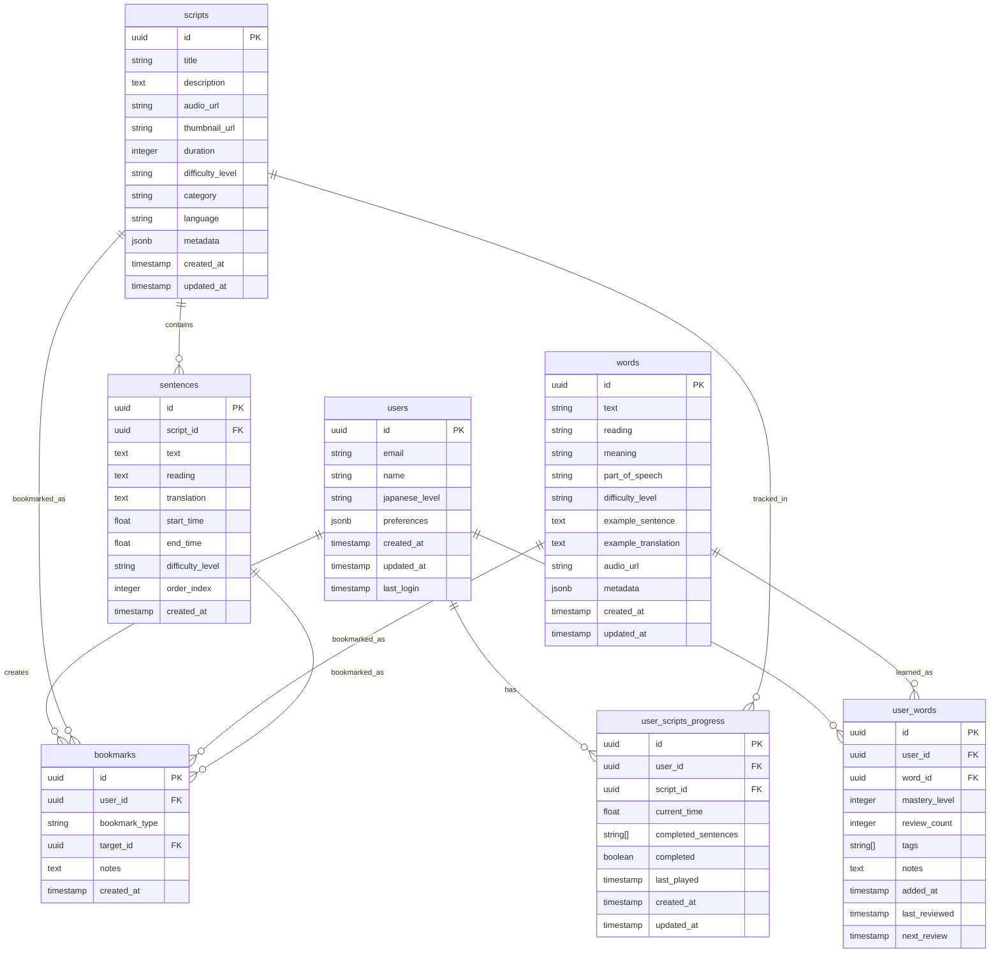

# 🗄️ 데이터베이스 스키마 설계 문서

## 📋 개요

Kiko 일본어 라디오 학습 플랫폼의 PostgreSQL 데이터베이스 스키마 설계안입니다.

- **DBMS**: PostgreSQL 15 (Supabase)
- **보안**: Row-Level Security (RLS) 적용
- **인증**: Supabase Auth 연동

## 🎯 데이터 모델 요구사항

### 핵심 기능별 데이터 요구사항

1. **사용자 관리**: 프로필, 설정, 학습 통계
2. **스크립트 관리**: 라디오/팟캐스트 콘텐츠, 문장 단위 분할
3. **단어장 시스템**: 개인 단어 저장, 복습 스케줄링
4. **학습 진행률**: 재생 위치, 완료 문장 추적
5. **북마크 시스템**: 스크립트/문장/단어 저장

## 📊 ERD (Entity Relationship Diagram)



## 🏗️ 테이블 상세 설계

### 1. users 테이블

사용자 기본 정보 및 설정을 관리합니다.

```sql
CREATE TABLE users (
    id UUID PRIMARY KEY DEFAULT gen_random_uuid(),
    email VARCHAR(255) UNIQUE NOT NULL,
    name VARCHAR(100) NOT NULL,
    japanese_level VARCHAR(20) DEFAULT 'beginner' CHECK (japanese_level IN ('beginner', 'intermediate', 'advanced')),
    preferences JSONB DEFAULT '{}',
    created_at TIMESTAMP WITH TIME ZONE DEFAULT NOW(),
    updated_at TIMESTAMP WITH TIME ZONE DEFAULT NOW(),
    last_login TIMESTAMP WITH TIME ZONE
);

-- 인덱스
CREATE INDEX idx_users_email ON users(email);
CREATE INDEX idx_users_japanese_level ON users(japanese_level);
CREATE INDEX idx_users_last_login ON users(last_login);
```

**preferences JSONB 스키마:**

```json
{
  "theme": "light|dark",
  "font_size": "small|medium|large",
  "auto_play": boolean,
  "repeat_mode": "none|sentence|word",
  "daily_goal_minutes": integer,
  "notifications": {
    "email": boolean,
    "web_push": boolean
  }
}
```

### 2. scripts 테이블

라디오/팟캐스트 스크립트 메타데이터를 관리합니다.

```sql
CREATE TABLE scripts (
    id UUID PRIMARY KEY DEFAULT gen_random_uuid(),
    title VARCHAR(200) NOT NULL,
    description TEXT,
    audio_url VARCHAR(500) NOT NULL,
    thumbnail_url VARCHAR(500),
    duration INTEGER NOT NULL, -- 총 재생 시간 (초)
    difficulty_level VARCHAR(20) DEFAULT 'beginner' CHECK (difficulty_level IN ('beginner', 'intermediate', 'advanced')),
    category VARCHAR(50) NOT NULL, -- news, anime, podcast, drama, etc.
    language VARCHAR(10) DEFAULT 'japanese',
    metadata JSONB DEFAULT '{}',
    created_at TIMESTAMP WITH TIME ZONE DEFAULT NOW(),
    updated_at TIMESTAMP WITH TIME ZONE DEFAULT NOW()
);

-- 인덱스
CREATE INDEX idx_scripts_category ON scripts(category);
CREATE INDEX idx_scripts_difficulty ON scripts(difficulty_level);
CREATE INDEX idx_scripts_created_at ON scripts(created_at DESC);
CREATE INDEX idx_scripts_duration ON scripts(duration);
```

**metadata JSONB 스키마:**

```json
{
  "source": "NHK|アニメ|ポッドキャスト",
  "tags": ["string"],
  "total_sentences": integer,
  "avg_sentence_length": float,
  "vocabulary_level": "N5|N4|N3|N2|N1"
}
```

### 3. sentences 테이블

스크립트의 개별 문장과 타임스탬프를 관리합니다.

```sql
CREATE TABLE sentences (
    id UUID PRIMARY KEY DEFAULT gen_random_uuid(),
    script_id UUID NOT NULL REFERENCES scripts(id) ON DELETE CASCADE,
    text TEXT NOT NULL,
    reading TEXT, -- 후리가나
    translation TEXT NOT NULL,
    start_time FLOAT NOT NULL, -- 시작 시간 (초)
    end_time FLOAT NOT NULL,   -- 종료 시간 (초)
    difficulty_level VARCHAR(20) DEFAULT 'beginner' CHECK (difficulty_level IN ('beginner', 'intermediate', 'advanced')),
    order_index INTEGER NOT NULL, -- 문장 순서
    created_at TIMESTAMP WITH TIME ZONE DEFAULT NOW(),

    -- 제약조건
    CONSTRAINT valid_time_range CHECK (end_time > start_time),
    CONSTRAINT valid_order_index CHECK (order_index >= 0)
);

-- 인덱스
CREATE INDEX idx_sentences_script_id ON sentences(script_id);
CREATE INDEX idx_sentences_order ON sentences(script_id, order_index);
CREATE INDEX idx_sentences_time_range ON sentences(script_id, start_time, end_time);
CREATE INDEX idx_sentences_difficulty ON sentences(difficulty_level);

-- 복합 인덱스 (성능 최적화)
CREATE INDEX idx_sentences_script_time ON sentences(script_id, start_time);
```

### 4. words 테이블

일본어 단어 사전 정보를 관리합니다.

```sql
CREATE TABLE words (
    id UUID PRIMARY KEY DEFAULT gen_random_uuid(),
    text VARCHAR(100) NOT NULL,
    reading VARCHAR(200), -- 히라가나 읽기
    meaning TEXT NOT NULL,
    part_of_speech VARCHAR(50) NOT NULL, -- 명사, 동사, 형용사 등
    difficulty_level VARCHAR(20) DEFAULT 'beginner' CHECK (difficulty_level IN ('beginner', 'intermediate', 'advanced')),
    example_sentence TEXT,
    example_translation TEXT,
    audio_url VARCHAR(500),
    metadata JSONB DEFAULT '{}',
    created_at TIMESTAMP WITH TIME ZONE DEFAULT NOW(),
    updated_at TIMESTAMP WITH TIME ZONE DEFAULT NOW(),

    -- 유니크 제약조건
    UNIQUE(text, reading, meaning)
);

-- 인덱스
CREATE INDEX idx_words_text ON words(text);
CREATE INDEX idx_words_reading ON words(reading);
CREATE INDEX idx_words_difficulty ON words(difficulty_level);
CREATE INDEX idx_words_part_of_speech ON words(part_of_speech);

-- 전문 검색을 위한 인덱스
CREATE INDEX idx_words_text_search ON words USING gin(to_tsvector('japanese', text || ' ' || reading || ' ' || meaning));
```

**metadata JSONB 스키마:**

```json
{
  "jlpt_level": "N5|N4|N3|N2|N1",
  "frequency_rank": integer,
  "conjugations": ["string"],
  "synonyms": ["string"],
  "antonyms": ["string"]
}
```

### 5. user_words 테이블

사용자별 개인 단어장을 관리합니다.

```sql
CREATE TABLE user_words (
    id UUID PRIMARY KEY DEFAULT gen_random_uuid(),
    user_id UUID NOT NULL REFERENCES users(id) ON DELETE CASCADE,
    word_id UUID NOT NULL REFERENCES words(id) ON DELETE CASCADE,
    mastery_level INTEGER DEFAULT 0 CHECK (mastery_level >= 0 AND mastery_level <= 5),
    review_count INTEGER DEFAULT 0,
    tags TEXT[] DEFAULT '{}',
    notes TEXT,
    added_at TIMESTAMP WITH TIME ZONE DEFAULT NOW(),
    last_reviewed TIMESTAMP WITH TIME ZONE,
    next_review TIMESTAMP WITH TIME ZONE,

    -- 유니크 제약조건
    UNIQUE(user_id, word_id)
);

-- 인덱스
CREATE INDEX idx_user_words_user_id ON user_words(user_id);
CREATE INDEX idx_user_words_mastery ON user_words(user_id, mastery_level);
CREATE INDEX idx_user_words_review_due ON user_words(user_id, next_review);
CREATE INDEX idx_user_words_tags ON user_words USING gin(tags);
CREATE INDEX idx_user_words_added_at ON user_words(user_id, added_at DESC);
```

### 6. user_scripts_progress 테이블

사용자별 스크립트 재생 진행률을 관리합니다.

```sql
CREATE TABLE user_scripts_progress (
    id UUID PRIMARY KEY DEFAULT gen_random_uuid(),
    user_id UUID NOT NULL REFERENCES users(id) ON DELETE CASCADE,
    script_id UUID NOT NULL REFERENCES scripts(id) ON DELETE CASCADE,
    current_time FLOAT DEFAULT 0, -- 현재 재생 위치 (초)
    completed_sentences UUID[] DEFAULT '{}', -- 완료한 문장 ID 배열
    completed BOOLEAN DEFAULT FALSE,
    last_played TIMESTAMP WITH TIME ZONE DEFAULT NOW(),
    created_at TIMESTAMP WITH TIME ZONE DEFAULT NOW(),
    updated_at TIMESTAMP WITH TIME ZONE DEFAULT NOW(),

    -- 유니크 제약조건
    UNIQUE(user_id, script_id),

    -- 제약조건
    CONSTRAINT valid_current_time CHECK (current_time >= 0)
);

-- 인덱스
CREATE INDEX idx_progress_user_id ON user_scripts_progress(user_id);
CREATE INDEX idx_progress_script_id ON user_scripts_progress(script_id);
CREATE INDEX idx_progress_last_played ON user_scripts_progress(user_id, last_played DESC);
CREATE INDEX idx_progress_completed ON user_scripts_progress(user_id, completed);
```

### 7. bookmarks 테이블

사용자의 북마크 (스크립트, 문장, 단어)를 관리합니다.

```sql
CREATE TABLE bookmarks (
    id UUID PRIMARY KEY DEFAULT gen_random_uuid(),
    user_id UUID NOT NULL REFERENCES users(id) ON DELETE CASCADE,
    bookmark_type VARCHAR(20) NOT NULL CHECK (bookmark_type IN ('script', 'sentence', 'word')),
    target_id UUID NOT NULL, -- scripts.id, sentences.id, words.id 참조
    notes TEXT,
    created_at TIMESTAMP WITH TIME ZONE DEFAULT NOW(),

    -- 유니크 제약조건
    UNIQUE(user_id, bookmark_type, target_id)
);

-- 인덱스
CREATE INDEX idx_bookmarks_user_id ON bookmarks(user_id);
CREATE INDEX idx_bookmarks_type ON bookmarks(user_id, bookmark_type);
CREATE INDEX idx_bookmarks_created_at ON bookmarks(user_id, created_at DESC);
```

## 🔒 Row-Level Security (RLS) 정책

### RLS 활성화

```sql
ALTER TABLE users ENABLE ROW LEVEL SECURITY;
ALTER TABLE user_words ENABLE ROW LEVEL SECURITY;
ALTER TABLE user_scripts_progress ENABLE ROW LEVEL SECURITY;
ALTER TABLE bookmarks ENABLE ROW LEVEL SECURITY;

-- 공개 테이블은 RLS 비활성화 (읽기 전용)
-- scripts, sentences, words 테이블은 모든 사용자가 읽을 수 있음
```

### 사용자 테이블 정책

```sql
-- 사용자는 자신의 정보만 조회/수정 가능
CREATE POLICY "users_own_data" ON users
    FOR ALL USING (auth.uid() = id);
```

### 사용자 단어장 정책

```sql
-- 사용자는 자신의 단어장만 관리 가능
CREATE POLICY "user_words_own_data" ON user_words
    FOR ALL USING (auth.uid() = user_id);
```

### 학습 진행률 정책

```sql
-- 사용자는 자신의 진행률만 관리 가능
CREATE POLICY "progress_own_data" ON user_scripts_progress
    FOR ALL USING (auth.uid() = user_id);
```

### 북마크 정책

```sql
-- 사용자는 자신의 북마크만 관리 가능
CREATE POLICY "bookmarks_own_data" ON bookmarks
    FOR ALL USING (auth.uid() = user_id);
```

### 공개 콘텐츠 정책

```sql
-- 모든 사용자가 스크립트, 문장, 단어 읽기 가능
CREATE POLICY "scripts_read_all" ON scripts FOR SELECT USING (true);
CREATE POLICY "sentences_read_all" ON sentences FOR SELECT USING (true);
CREATE POLICY "words_read_all" ON words FOR SELECT USING (true);
```

## ⚡ 성능 최적화 설계

### 주요 쿼리 패턴 분석

1. **스크립트 목록 조회**: category, difficulty 필터링
2. **문장 순차 조회**: script_id + order_index 정렬
3. **단어장 조회**: user_id + mastery_level 필터링
4. **복습 단어 조회**: user_id + next_review 날짜 범위
5. **재생 진행률 조회**: user_id + script_id

### 복합 인덱스 전략

```sql
-- 스크립트 필터링 최적화
CREATE INDEX idx_scripts_category_difficulty ON scripts(category, difficulty_level, created_at DESC);

-- 문장 재생 순서 최적화
CREATE INDEX idx_sentences_script_order ON sentences(script_id, order_index);

-- 단어장 복습 최적화
CREATE INDEX idx_user_words_review_schedule ON user_words(user_id, next_review, mastery_level);

-- 학습 통계 최적화
CREATE INDEX idx_progress_stats ON user_scripts_progress(user_id, completed, last_played DESC);
```

### 파티셔닝 계획 (확장 시)

```sql
-- 사용량 증가 시 월별 파티셔닝 고려
-- user_scripts_progress 테이블을 last_played 기준으로 파티셔닝
-- 예: progress_2024_01, progress_2024_02, ...
```

## 📈 데이터 관리 정책

### 자동 업데이트 트리거

```sql
-- updated_at 자동 갱신
CREATE OR REPLACE FUNCTION update_updated_at_column()
RETURNS TRIGGER AS $$
BEGIN
    NEW.updated_at = NOW();
    RETURN NEW;
END;
$$ language 'plpgsql';

CREATE TRIGGER update_users_updated_at BEFORE UPDATE ON users
    FOR EACH ROW EXECUTE FUNCTION update_updated_at_column();

CREATE TRIGGER update_scripts_updated_at BEFORE UPDATE ON scripts
    FOR EACH ROW EXECUTE FUNCTION update_updated_at_column();

CREATE TRIGGER update_words_updated_at BEFORE UPDATE ON words
    FOR EACH ROW EXECUTE FUNCTION update_updated_at_column();

CREATE TRIGGER update_progress_updated_at BEFORE UPDATE ON user_scripts_progress
    FOR EACH ROW EXECUTE FUNCTION update_updated_at_column();
```

### 데이터 정합성 검증

```sql
-- 문장 시간 범위 검증
CREATE OR REPLACE FUNCTION validate_sentence_time_range()
RETURNS TRIGGER AS $$
BEGIN
    -- 스크립트 총 재생 시간 내에 있는지 확인
    IF EXISTS (
        SELECT 1 FROM scripts
        WHERE id = NEW.script_id
        AND NEW.end_time > duration
    ) THEN
        RAISE EXCEPTION 'Sentence end time exceeds script duration';
    END IF;
    RETURN NEW;
END;
$$ language 'plpgsql';

CREATE TRIGGER validate_sentence_time BEFORE INSERT OR UPDATE ON sentences
    FOR EACH ROW EXECUTE FUNCTION validate_sentence_time_range();
```

## 🧪 테스트 데이터 계획

### 초기 시드 데이터

1. **샘플 스크립트**: 3-5개 (뉴스, 애니메이션, 팟캐스트)
2. **기본 단어**: 1000개 (JLPT N5-N4 수준)
3. **테스트 사용자**: 개발/테스트용 계정

### 성능 테스트 데이터

- **스크립트**: 100개
- **문장**: 10,000개
- **단어**: 50,000개
- **사용자**: 1,000명
- **학습 데이터**: 10,000개

## 📋 마이그레이션 전략

### 1. 기본 스키마 생성

```sql
-- 01_create_base_tables.sql
-- 기본 테이블 구조 생성
```

### 2. 인덱스 및 제약조건

```sql
-- 02_create_indexes.sql
-- 성능 최적화 인덱스 생성
```

### 3. RLS 정책 적용

```sql
-- 03_setup_rls.sql
-- Row-Level Security 정책 설정
```

### 4. 트리거 및 함수

```sql
-- 04_create_triggers.sql
-- 자동화 트리거 및 검증 함수
```

### 5. 초기 데이터

```sql
-- 05_seed_data.sql
-- 기본 단어, 샘플 스크립트 데이터
```

## ✅ 검증 체크리스트

- [ ] 모든 테이블 생성 및 관계 설정 완료
- [ ] 인덱스 성능 최적화 적용
- [ ] RLS 정책 올바른 동작 확인
- [ ] 트리거 및 제약조건 테스트
- [ ] 백엔드 Pydantic 모델과 일치성 검증
- [ ] 샘플 데이터 삽입 및 쿼리 테스트
- [ ] API 엔드포인트 연동 테스트

---

**작성일**: 2024-01-XX  
**작성자**: Claude AI  
**검토자**: [개발팀]  
**승인자**: [프로젝트 매니저]
