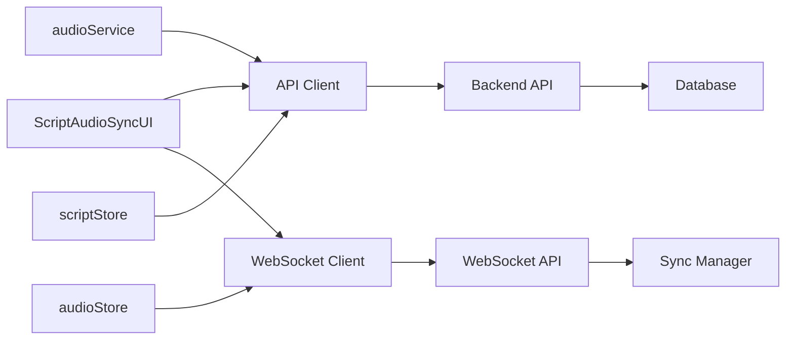

# 백엔드 통합 구현 계획서 (T-007)

## 1. 개요

### 1.1 목적

T-006에서 완성된 프론트엔드 플레이어와 T-003/T-004에서 구현된 백엔드 API의 완전한 통합을 통해 실제 동작하는 일본어 라디오 학습 플랫폼을 구축합니다.

### 1.2 범위

- 스크립트 데이터 조회 및 표시
- 오디오 스트리밍 및 재생 제어
- 실시간 스크립트-오디오 동기화
- 사용자 진행률 저장 및 복원
- WebSocket 기반 실시간 상태 동기화
- 인증 및 에러 처리

---

## 2. 코드베이스 분석 결과

### 2.1 백엔드 API 구조 분석

#### 🔹 핵심 API 엔드포인트

| 엔드포인트                                 | 메서드    | 목적                       | 상태        |
| ------------------------------------------ | --------- | -------------------------- | ----------- |
| `/api/v1/scripts/`                         | GET       | 스크립트 목록 조회         | ✅ 구현완료 |
| `/api/v1/scripts/{script_id}`              | GET       | 스크립트 상세 및 문장 조회 | ✅ 구현완료 |
| `/api/v1/audio/stream/{script_id}`         | GET       | 오디오 스트림 URL 조회     | ✅ 구현완료 |
| `/api/v1/audio/play`                       | POST      | 재생 세션 생성             | ✅ 구현완료 |
| `/api/v1/audio/progress`                   | PUT       | 진행률 업데이트            | ✅ 구현완료 |
| `/api/v1/sync/mappings/script/{script_id}` | GET       | 문장 매핑 조회             | ✅ 구현완료 |
| `/ws/sync/{script_id}`                     | WebSocket | 실시간 동기화              | ✅ 구현완료 |

#### 🔹 서비스 레이어 구조

```
backend/app/services/
├── audio/
│   └── audio_service.py          # 오디오 스트리밍, 캐싱, 세션 관리
└── sync/
    └── sync_mapping_service.py   # 문장 매핑, 편집 내역 관리
```

#### 🔹 데이터 모델

- **AudioService**: HLS 스트리밍, 캐시 관리, 재생 세션
- **SyncMappingService**: 문장-타임코드 매핑, 실시간 편집
- **WebSocket Manager**: 실시간 위치 동기화, 매핑 업데이트 브로드캐스트

### 2.2 프론트엔드 구조 분석

#### 🔹 기존 구현 상태

| 컴포넌트          | 파일                            | 기능               | 상태    |
| ----------------- | ------------------------------- | ------------------ | ------- |
| audioService      | `/lib/services/audioService.ts` | HTML5 Audio 제어   | ✅ 완료 |
| audioStore        | `/lib/stores/audioStore.ts`     | 오디오 상태 관리   | ✅ 완료 |
| scriptStore       | `/lib/stores/scriptStore.ts`    | 스크립트 상태 관리 | ✅ 완료 |
| ScriptAudioSyncUI | `/lib/components/sync/`         | 통합 UI 컴포넌트   | ✅ 완료 |

#### 🔹 부족한 부분 (구현 필요)

- **API 클라이언트**: 백엔드 API 호출 모듈
- **WebSocket 클라이언트**: 실시간 동기화 처리
- **데이터 통합**: 백엔드 응답을 프론트엔드 타입으로 변환
- **에러 처리**: API 실패, 네트워크 오류 등 포괄적 처리
- **인증 통합**: JWT 토큰 관리 및 API 인증

---

## 3. 통합 아키텍처 설계

### 3.1 데이터 플로우



### 3.2 API 통합 패턴

#### 🔹 RESTful API 통합

```typescript
// 기본 패턴
초기 로드: GET /api/v1/scripts/{id} → scriptStore 업데이트
오디오 요청: GET /api/v1/audio/stream/{id} → audioService 연동
진행률 저장: PUT /api/v1/audio/progress → 백그라운드 동기화
```

#### 🔹 WebSocket 실시간 동기화

```typescript
// 실시간 이벤트
재생 위치 변경 → WebSocket broadcast → 다른 클라이언트 동기화
문장 매핑 편집 → WebSocket notification → UI 실시간 업데이트
```

### 3.3 에러 처리 전략

#### 🔹 API 에러 레벨

1. **네트워크 에러**: 재시도 로직 + 오프라인 모드
2. **인증 에러**: 자동 토큰 갱신 + 로그인 리다이렉트
3. **데이터 에러**: 사용자 친화적 메시지 + 폴백 UI
4. **서버 에러**: 에러 리포팅 + 대체 서비스

---

## 4. 구현 로드맵

### 4.1 Phase 1: API 클라이언트 구현 (T-007-002)

#### 4.1.1 BaseAPI 클라이언트 구현

```typescript
// frontend/src/lib/api/client.ts
class ApiClient {
  private baseURL: string;
  private authToken: string | null;

  async request<T>(endpoint: string, options?: RequestInit): Promise<T>;
  async get<T>(endpoint: string): Promise<T>;
  async post<T>(endpoint: string, data: any): Promise<T>;
  // 인증, 에러 처리, 재시도 로직 포함
}
```

#### 4.1.2 도메인별 API 서비스

```typescript
// frontend/src/lib/api/
├── scripts.ts      # 스크립트 조회, 문장 목록
├── audio.ts        # 오디오 스트림, 재생 세션
├── sync.ts         # 매핑 조회/수정
└── auth.ts         # 로그인, 토큰 관리
```

#### 4.1.3 타입 정의 확장

```typescript
// 백엔드 응답 타입과 프론트엔드 타입 매핑
interface BackendScript → Script 변환 함수
interface BackendSentence → Sentence 변환 함수
interface BackendMapping → SentenceMapping 변환 함수
```

### 4.2 Phase 2: WebSocket 클라이언트 구현

#### 4.2.1 WebSocket 서비스

```typescript
// frontend/src/lib/services/websocketService.ts
class WebSocketService {
  connect(scriptId: string): Promise<void>;
  sendPositionUpdate(position: number, isPlaying: boolean): void;
  onMappingUpdate(callback: (data) => void): void;
  disconnect(): void;
}
```

#### 4.2.2 Store 통합

```typescript
// audioStore, scriptStore와 WebSocket 연동
audioStore.subscribe((state) => websocketService.sendPositionUpdate());
websocketService.onMappingUpdate((data) => scriptStore.updateMapping());
```

### 4.3 Phase 3: 컴포넌트 통합

#### 4.3.1 데이터 로딩 통합

```typescript
// ScriptAudioSyncUI에서 실제 API 호출
onMount(() => {
  const script = await scriptsApi.getScript(scriptId);
  const mappings = await syncApi.getScriptMappings(scriptId);
  const audioStream = await audioApi.getStreamInfo(scriptId);
});
```

#### 4.3.2 실시간 동기화 통합

```typescript
// 실시간 이벤트 처리
websocketService.connect(scriptId);
websocketService.onPositionSync(syncToPosition);
websocketService.onMappingUpdate(updateMapping);
```

### 4.4 Phase 4: 에러 처리 및 최적화

#### 4.4.1 포괄적 에러 처리

```typescript
// 네트워크 에러 처리
try {
  await api.request();
} catch (error) {
  if (error instanceof NetworkError) {
    showRetryDialog();
  } else if (error instanceof AuthError) {
    redirectToLogin();
  }
}
```

#### 4.4.2 성능 최적화

- API 응답 캐싱 (SWR 패턴)
- WebSocket 연결 풀링
- 지연 로딩 및 프리페칭

---

## 5. 통합 시나리오 테스트 계획 (T-007-003)

### 5.1 기본 시나리오

1. **스크립트 로딩**: 목록 조회 → 상세 조회 → 문장/매핑 표시
2. **오디오 재생**: 스트림 요청 → 재생 시작 → 진행률 동기화
3. **문장 클릭**: 문장 클릭 → 해당 시간으로 점프 → WebSocket 브로드캐스트
4. **AB 반복**: A/B 포인트 설정 → 구간 반복 → 진행률 업데이트

### 5.2 에러 시나리오

1. **네트워크 단절**: 오프라인 모드 → 재연결 시 동기화
2. **API 오류**: 에러 메시지 표시 → 재시도 옵션
3. **인증 만료**: 자동 갱신 → 실패 시 로그인 유도
4. **WebSocket 연결 실패**: 폴백 모드 → 주기적 재연결

### 5.3 성능 테스트

1. **로딩 성능**: TTI ≤ 2.5s, API 응답 ≤ 300ms
2. **동기화 정확도**: WebSocket 지연 ≤ 100ms
3. **메모리 사용량**: 오디오 캐시 최적화
4. **배터리 효율성**: 백그라운드 처리 최소화

---

## 6. 위험 요소 및 대응 방안

### 6.1 기술적 위험

| 위험                  | 확률 | 영향도 | 대응 방안                     |
| --------------------- | ---- | ------ | ----------------------------- |
| API 호환성 불일치     | 중   | 고     | 스키마 검증, 통합 테스트 강화 |
| WebSocket 연결 불안정 | 고   | 중     | 재연결 로직, 폴백 모드        |
| 오디오 스트리밍 지연  | 중   | 고     | CDN 최적화, 프리페칭          |
| 브라우저 호환성       | 저   | 중     | 폴리필, 기능 감지             |

### 6.2 사용자 경험 위험

| 위험             | 대응 방안                     |
| ---------------- | ----------------------------- |
| 로딩 시간 길어짐 | 스켈레톤 UI, 점진적 로딩      |
| 동기화 지연      | 시각적 피드백, 오프라인 표시  |
| 에러 빈발        | 친화적 에러 메시지, 자동 복구 |

---

## 7. 성공 기준

### 7.1 기능적 요구사항

- [ ] 모든 백엔드 API 정상 연동
- [ ] 실시간 WebSocket 동기화 동작
- [ ] 에러 상황 적절한 처리
- [ ] 사용자 인증 플로우 완성

### 7.2 비기능적 요구사항

- [ ] 페이지 로딩 시간 ≤ 2.5초
- [ ] API 응답 시간 p95 ≤ 300ms
- [ ] WebSocket 연결 성공률 ≥ 99%
- [ ] 크로스 브라우저 호환성 확보

### 7.3 사용자 경험 기준

- [ ] 매끄러운 오디오 재생 (버퍼링 < 500ms)
- [ ] 정확한 문장 하이라이트 (±200ms)
- [ ] 직관적인 에러 메시지
- [ ] 접근성 기준 WCAG 2.1 AA 준수

---

## 8. 다음 단계

1. **T-007-002**: API 클라이언트 및 통합 모듈 구현
2. **T-007-003**: 통합 시나리오 테스트 및 검증
3. **최종 검토**: 성능, 보안, 사용성 종합 점검

---

**작성일**: 2024년 1월
**담당자**: AI Agent
**검토자**: 개발팀
**승인자**: 프로젝트 매니저
