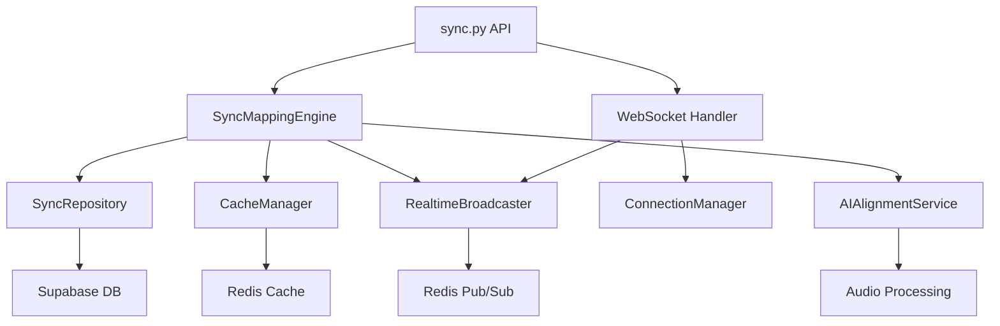

# 싱크 매핑 엔진 공통 모듈 설계

## 1. 개요

### 1.1 목적

기존 코드베이스와 일관성을 유지하면서 싱크 매핑 엔진의 새로운 모듈들을 설계. 기존 패턴 (의존성 주입, 추상화 레이어, 도메인 분리)을 준수하며 확장 가능한 구조 제공.

### 1.2 기존 패턴 준수

```python
# 기존 패턴 분석 결과
✅ Domain-driven 설계: /services/, /models/, /core/ 분리
✅ 의존성 주입: get_audio_service(), get_cache_manager() 패턴
✅ 추상화 레이어: CacheBackend, StorageBackend 인터페이스
✅ 에러 처리: HTTPException + 구조화된 에러 응답
✅ 비동기 I/O: async/await 기반 모든 I/O 작업
```

---

## 2. 모듈 아키텍처 설계

### 2.1 전체 모듈 구조

```
app/
├── models/
│   └── sync.py                 # 새 모듈: 동기화 Pydantic 모델
├── services/
│   └── sync/                   # 새 패키지: 동기화 서비스
│       ├── __init__.py
│       ├── sync_mapping_engine.py
│       ├── ai_alignment_service.py
│       └── realtime_broadcaster.py
├── repositories/               # 새 패키지: 데이터 접근 계층
│   ├── __init__.py
│   └── sync_repository.py
├── websocket/                  # 새 패키지: WebSocket 처리
│   ├── __init__.py
│   ├── router.py
│   ├── connection_manager.py
│   └── handlers.py
├── api/v1/endpoints/
│   └── sync.py                 # 새 모듈: 동기화 API 엔드포인트
└── core/
    ├── cache/
    │   └── cache_manager.py    # 확장: 동기화 캐시 추가
    └── websocket.py            # 새 모듈: WebSocket 공통 기능
```

### 2.2 의존성 관계도



---

## 3. 핵심 인터페이스 설계

### 3.1 SyncMappingEngine (핵심 비즈니스 로직)

```python
# app/services/sync/sync_mapping_engine.py
from abc import ABC, abstractmethod
from typing import Optional, List, UUID
from datetime import datetime

class ISyncMappingEngine(ABC):
    """동기화 매핑 엔진 인터페이스"""

    @abstractmethod
    async def get_current_sentence(
        self,
        script_id: UUID,
        position: float
    ) -> Optional[SentenceSync]:
        """현재 재생 위치의 문장 조회"""
        pass

    @abstractmethod
    async def update_timecode_mapping(
        self,
        sentence_id: UUID,
        start_time: float,
        end_time: float,
        user_id: UUID,
        reason: Optional[str] = None
    ) -> MappingResult:
        """타임코드 수동 편집"""
        pass

    @abstractmethod
    async def get_script_mappings(
        self,
        script_id: UUID,
        version: Optional[int] = None
    ) -> List[SentenceMapping]:
        """스크립트의 모든 매핑 조회"""
        pass

    @abstractmethod
    async def validate_timecode_range(
        self,
        script_id: UUID,
        sentence_id: UUID,
        start_time: float,
        end_time: float
    ) -> ValidationResult:
        """타임코드 범위 검증 (겹침 등)"""
        pass


class SyncMappingEngine(ISyncMappingEngine):
    """동기화 매핑 엔진 구현체"""

    def __init__(
        self,
        repository: ISyncRepository,
        cache_manager: CacheManager,
        broadcaster: IRealtimeBroadcaster
    ):
        self.repository = repository
        self.cache = cache_manager
        self.broadcaster = broadcaster

    async def get_current_sentence(
        self,
        script_id: UUID,
        position: float
    ) -> Optional[SentenceSync]:
        """위치 기반 문장 조회 (캐시 우선)"""

        # 캐시 확인
        cached = await self.cache.get_current_sentence(script_id, position)
        if cached:
            return SentenceSync(**cached)

        # DB 조회
        sentence = await self.repository.get_sentence_at_position(
            script_id, position
        )

        if sentence:
            # 캐시 저장 (5초 TTL)
            await self.cache.set_current_sentence(
                script_id, position, sentence.dict(), ttl=5
            )

        return sentence

    async def update_timecode_mapping(
        self,
        sentence_id: UUID,
        start_time: float,
        end_time: float,
        user_id: UUID,
        reason: Optional[str] = None
    ) -> MappingResult:
        """타임코드 편집 및 실시간 전파"""

        try:
            # 1. 검증
            validation = await self.validate_timecode_range(
                script_id, sentence_id, start_time, end_time
            )
            if not validation.is_valid:
                return MappingResult(
                    success=False,
                    error=validation.error_message
                )

            # 2. 기존 매핑 조회
            old_mapping = await self.repository.get_sentence_mapping(sentence_id)

            # 3. 새 매핑 생성
            new_mapping = await self.repository.create_sentence_mapping(
                sentence_id=sentence_id,
                start_time=start_time,
                end_time=end_time,
                mapping_type="manual",
                created_by=user_id
            )

            # 4. 편집 내역 기록
            await self.repository.create_mapping_edit(
                sentence_id=sentence_id,
                user_id=user_id,
                old_start_time=old_mapping.start_time if old_mapping else None,
                old_end_time=old_mapping.end_time if old_mapping else None,
                new_start_time=start_time,
                new_end_time=end_time,
                edit_reason=reason
            )

            # 5. 캐시 무효화
            script_id = await self.repository.get_script_id_by_sentence(sentence_id)
            await self.cache.invalidate_script_mappings(script_id)

            # 6. 실시간 브로드캐스트
            await self.broadcaster.broadcast_mapping_update(
                script_id=script_id,
                sentence_id=sentence_id,
                start_time=start_time,
                end_time=end_time,
                updated_by=user_id
            )

            return MappingResult(
                success=True,
                mapping_id=new_mapping.id,
                confidence_score=1.0  # 수동 편집은 신뢰도 100%
            )

        except Exception as e:
            logger.error(f"Mapping update failed: {e}")
            return MappingResult(
                success=False,
                error=f"Internal error: {str(e)}"
            )
```

### 3.2 데이터 접근 계층 (Repository Pattern)

```python
# app/repositories/sync_repository.py
from abc import ABC, abstractmethod
from typing import Optional, List, UUID

class ISyncRepository(ABC):
    """동기화 데이터 접근 인터페이스"""

    @abstractmethod
    async def get_sentence_at_position(
        self,
        script_id: UUID,
        position: float
    ) -> Optional[SentenceSync]:
        pass

    @abstractmethod
    async def get_sentence_mapping(
        self,
        sentence_id: UUID
    ) -> Optional[SentenceMapping]:
        pass

    @abstractmethod
    async def create_sentence_mapping(
        self,
        sentence_id: UUID,
        start_time: float,
        end_time: float,
        mapping_type: str,
        created_by: UUID,
        confidence_score: float = 0.0
    ) -> SentenceMapping:
        pass

    @abstractmethod
    async def get_script_mappings(
        self,
        script_id: UUID,
        active_only: bool = True
    ) -> List[SentenceMapping]:
        pass


class SyncRepository(ISyncRepository):
    """Supabase 기반 동기화 데이터 접근 구현체"""

    def __init__(self, database_manager: DatabaseManager):
        self.db = database_manager

    async def get_sentence_at_position(
        self,
        script_id: UUID,
        position: float
    ) -> Optional[SentenceSync]:
        """특정 위치의 문장 조회"""

        # 최신 활성 매핑을 우선하되, 없으면 기본 sentences 테이블 조회
        query = """
        SELECT
            s.id,
            s.script_id,
            s.text,
            s.reading,
            s.translation,
            s.order_index,
            COALESCE(sm.start_time, s.start_time) as start_time,
            COALESCE(sm.end_time, s.end_time) as end_time,
            COALESCE(sm.confidence_score, 0.5) as confidence_score,
            COALESCE(sm.mapping_type, 'default') as mapping_type
        FROM sentences s
        LEFT JOIN sentence_mappings sm ON s.id = sm.sentence_id
            AND sm.is_active = true
        WHERE s.script_id = $1
            AND COALESCE(sm.start_time, s.start_time) <= $2
            AND COALESCE(sm.end_time, s.end_time) > $2
        ORDER BY s.order_index
        LIMIT 1
        """

        result = await self.db.fetch_one(query, [str(script_id), position])

        if result:
            return SentenceSync(**dict(result))
        return None

    async def create_sentence_mapping(
        self,
        sentence_id: UUID,
        start_time: float,
        end_time: float,
        mapping_type: str,
        created_by: UUID,
        confidence_score: float = 0.0
    ) -> SentenceMapping:
        """새 매핑 생성 (기존 매핑 비활성화)"""

        async with self.db.transaction():
            # 기존 활성 매핑 비활성화
            await self.db.execute(
                "UPDATE sentence_mappings SET is_active = false WHERE sentence_id = $1",
                [str(sentence_id)]
            )

            # 새 매핑 생성
            mapping_data = {
                'sentence_id': sentence_id,
                'start_time': start_time,
                'end_time': end_time,
                'mapping_type': mapping_type,
                'created_by': created_by,
                'confidence_score': confidence_score,
                'is_active': True
            }

            result = await self.db.create("sentence_mappings", mapping_data)
            return SentenceMapping(**result)
```

### 3.3 WebSocket 연결 관리

```python
# app/websocket/connection_manager.py
from typing import Dict, Set, List
import json
import asyncio
from fastapi import WebSocket
import redis.asyncio as redis

class ConnectionManager:
    """WebSocket 연결 관리자"""

    def __init__(self, redis_client: redis.Redis):
        self.redis = redis_client
        self.connections: Dict[str, Set[WebSocket]] = {}  # script_id -> WebSocket set
        self.user_connections: Dict[str, WebSocket] = {}  # user_id -> WebSocket

    async def connect(
        self,
        websocket: WebSocket,
        script_id: str,
        user_id: str
    ):
        """스크립트 룸 연결"""
        await websocket.accept()

        # 룸 추가
        if script_id not in self.connections:
            self.connections[script_id] = set()
        self.connections[script_id].add(websocket)

        # 사용자 연결 추가
        self.user_connections[user_id] = websocket

        # Redis에 세션 등록
        await self._register_session(script_id, user_id, websocket)

        # 룸 입장 알림
        await self.broadcast_to_room(script_id, {
            "type": "user_joined",
            "user_id": user_id,
            "room_size": len(self.connections[script_id])
        }, exclude=websocket)

    async def disconnect(self, websocket: WebSocket, script_id: str, user_id: str):
        """연결 해제"""
        if script_id in self.connections:
            self.connections[script_id].discard(websocket)
            if not self.connections[script_id]:
                del self.connections[script_id]

        self.user_connections.pop(user_id, None)

        # Redis 세션 제거
        await self._unregister_session(script_id, user_id)

        # 룸 퇴장 알림
        if script_id in self.connections:
            await self.broadcast_to_room(script_id, {
                "type": "user_left",
                "user_id": user_id,
                "room_size": len(self.connections[script_id])
            })

    async def broadcast_to_room(
        self,
        script_id: str,
        message: dict,
        exclude: WebSocket = None
    ):
        """룸 내 모든 연결에 메시지 브로드캐스트"""
        if script_id not in self.connections:
            return

        message_str = json.dumps(message)
        disconnected = []

        for connection in self.connections[script_id]:
            if connection == exclude:
                continue

            try:
                await connection.send_text(message_str)
            except:
                disconnected.append(connection)

        # 끊어진 연결 정리
        for conn in disconnected:
            self.connections[script_id].discard(conn)

    async def send_to_user(self, user_id: str, message: dict):
        """특정 사용자에게 메시지 전송"""
        if user_id in self.user_connections:
            try:
                await self.user_connections[user_id].send_text(
                    json.dumps(message)
                )
            except:
                del self.user_connections[user_id]
```

### 3.4 실시간 브로드캐스터

```python
# app/services/sync/realtime_broadcaster.py
from abc import ABC, abstractmethod
from typing import UUID
import json

class IRealtimeBroadcaster(ABC):
    """실시간 브로드캐스트 인터페이스"""

    @abstractmethod
    async def broadcast_sentence_highlight(
        self,
        script_id: UUID,
        sentence_id: UUID,
        position: float,
        user_id: UUID
    ):
        pass

    @abstractmethod
    async def broadcast_mapping_update(
        self,
        script_id: UUID,
        sentence_id: UUID,
        start_time: float,
        end_time: float,
        updated_by: UUID
    ):
        pass


class RealtimeBroadcaster(IRealtimeBroadcaster):
    """Redis Pub/Sub 기반 실시간 브로드캐스터"""

    def __init__(
        self,
        connection_manager: ConnectionManager,
        redis_client
    ):
        self.connection_manager = connection_manager
        self.redis = redis_client

    async def broadcast_sentence_highlight(
        self,
        script_id: UUID,
        sentence_id: UUID,
        position: float,
        user_id: UUID
    ):
        """문장 하이라이트 동기화"""
        message = {
            "type": "sentence_highlight",
            "script_id": str(script_id),
            "sentence_id": str(sentence_id),
            "position": position,
            "user_id": str(user_id),
            "timestamp": datetime.utcnow().isoformat()
        }

        # 로컬 WebSocket 브로드캐스트
        await self.connection_manager.broadcast_to_room(
            str(script_id),
            message
        )

        # Redis Pub/Sub으로 다른 서버에 전파
        await self.redis.publish(
            f"sync:script:{script_id}",
            json.dumps(message)
        )

    async def broadcast_mapping_update(
        self,
        script_id: UUID,
        sentence_id: UUID,
        start_time: float,
        end_time: float,
        updated_by: UUID
    ):
        """타임코드 매핑 변경 전파"""
        message = {
            "type": "mapping_update",
            "script_id": str(script_id),
            "sentence_id": str(sentence_id),
            "start_time": start_time,
            "end_time": end_time,
            "updated_by": str(updated_by),
            "timestamp": datetime.utcnow().isoformat()
        }

        await self.connection_manager.broadcast_to_room(
            str(script_id),
            message
        )

        await self.redis.publish(
            f"sync:script:{script_id}",
            json.dumps(message)
        )
```

---

## 4. 모델 정의 (Pydantic)

### 4.1 핵심 데이터 모델

```python
# app/models/sync.py
from pydantic import BaseModel, Field, validator
from typing import Optional, List, Literal
from datetime import datetime
from uuid import UUID

# 열거형 타입
MappingType = Literal["auto", "manual", "ai_generated"]
SyncMessageType = Literal[
    "sentence_highlight",
    "position_sync",
    "mapping_update",
    "user_joined",
    "user_left"
]

class SentenceSync(BaseModel):
    """문장 동기화 정보"""
    id: UUID
    script_id: UUID
    text: str
    reading: Optional[str] = None
    translation: str
    start_time: float
    end_time: float
    order_index: int
    confidence_score: float = Field(ge=0.0, le=1.0)
    mapping_type: MappingType

    @validator('end_time')
    def validate_time_range(cls, v, values):
        if 'start_time' in values and v <= values['start_time']:
            raise ValueError('end_time must be greater than start_time')
        return v

class SentenceMapping(BaseModel):
    """타임코드 매핑"""
    id: UUID
    sentence_id: UUID
    version: int = 1
    start_time: float
    end_time: float
    confidence_score: float = Field(ge=0.0, le=1.0)
    mapping_type: MappingType
    created_by: Optional[UUID] = None
    created_at: datetime
    is_active: bool = True

class MappingEdit(BaseModel):
    """매핑 편집 내역"""
    id: UUID
    sentence_id: UUID
    user_id: UUID
    old_start_time: Optional[float] = None
    old_end_time: Optional[float] = None
    new_start_time: float
    new_end_time: float
    edit_reason: Optional[str] = None
    created_at: datetime

class SyncSession(BaseModel):
    """동기화 세션"""
    id: UUID
    script_id: UUID
    user_id: Optional[UUID] = None
    connection_id: str
    current_sentence_id: Optional[UUID] = None
    current_position: float = 0
    joined_at: datetime
    last_activity: datetime
    is_active: bool = True

# 요청/응답 모델
class TimecodeUpdateRequest(BaseModel):
    """타임코드 수정 요청"""
    start_time: float = Field(ge=0)
    end_time: float = Field(gt=0)
    reason: Optional[str] = Field(None, max_length=500)

    @validator('end_time')
    def validate_time_range(cls, v, values):
        if 'start_time' in values and v <= values['start_time']:
            raise ValueError('end_time must be greater than start_time')
        return v

class MappingResult(BaseModel):
    """매핑 결과"""
    success: bool
    mapping_id: Optional[UUID] = None
    confidence_score: Optional[float] = None
    error: Optional[str] = None

class ValidationResult(BaseModel):
    """검증 결과"""
    is_valid: bool
    error_message: Optional[str] = None
    overlapping_sentences: List[UUID] = []

class SyncMessage(BaseModel):
    """WebSocket 메시지"""
    type: SyncMessageType
    script_id: str
    data: dict
    timestamp: datetime = Field(default_factory=datetime.utcnow)

# AI 정렬 관련
class AlignmentRequest(BaseModel):
    """자동 정렬 요청"""
    script_id: UUID
    force_realign: bool = False
    confidence_threshold: float = Field(default=0.7, ge=0.0, le=1.0)

class AlignmentResult(BaseModel):
    """자동 정렬 결과"""
    success: bool
    processed_sentences: int = 0
    accuracy_score: Optional[float] = None
    low_confidence_count: int = 0
    processing_time: Optional[float] = None
    error: Optional[str] = None
```

---

## 5. 의존성 주입 설정

### 5.1 서비스 팩토리 패턴

```python
# app/services/sync/__init__.py
from typing import Optional
from app.core.cache.cache_manager import get_cache_manager
from app.core.database import get_database
from app.repositories.sync_repository import SyncRepository
from app.services.sync.sync_mapping_engine import SyncMappingEngine
from app.services.sync.realtime_broadcaster import RealtimeBroadcaster
from app.websocket.connection_manager import ConnectionManager

# 전역 인스턴스
_sync_engine: Optional[SyncMappingEngine] = None
_sync_repository: Optional[SyncRepository] = None
_connection_manager: Optional[ConnectionManager] = None
_broadcaster: Optional[RealtimeBroadcaster] = None

async def get_sync_repository() -> SyncRepository:
    """동기화 레포지토리 의존성"""
    global _sync_repository
    if not _sync_repository:
        db = await get_database()
        _sync_repository = SyncRepository(db)
    return _sync_repository

async def get_connection_manager() -> ConnectionManager:
    """WebSocket 연결 관리자 의존성"""
    global _connection_manager
    if not _connection_manager:
        # Redis 클라이언트는 기존 캐시 매니저에서 재사용
        cache_manager = get_cache_manager()
        redis_client = cache_manager.backend.redis if hasattr(cache_manager.backend, 'redis') else None
        _connection_manager = ConnectionManager(redis_client)
    return _connection_manager

async def get_realtime_broadcaster() -> RealtimeBroadcaster:
    """실시간 브로드캐스터 의존성"""
    global _broadcaster
    if not _broadcaster:
        connection_manager = await get_connection_manager()
        cache_manager = get_cache_manager()
        redis_client = cache_manager.backend.redis if hasattr(cache_manager.backend, 'redis') else None
        _broadcaster = RealtimeBroadcaster(connection_manager, redis_client)
    return _broadcaster

async def get_sync_mapping_engine() -> SyncMappingEngine:
    """동기화 매핑 엔진 의존성"""
    global _sync_engine
    if not _sync_engine:
        repository = await get_sync_repository()
        cache_manager = get_cache_manager()
        broadcaster = await get_realtime_broadcaster()
        _sync_engine = SyncMappingEngine(repository, cache_manager, broadcaster)
    return _sync_engine

# 정리 함수 (테스트용)
def clear_sync_dependencies():
    """의존성 정리 (주로 테스트에서 사용)"""
    global _sync_engine, _sync_repository, _connection_manager, _broadcaster
    _sync_engine = None
    _sync_repository = None
    _connection_manager = None
    _broadcaster = None
```

### 5.2 FastAPI 의존성 통합

```python
# app/api/v1/endpoints/sync.py
from fastapi import APIRouter, Depends, HTTPException
from app.services.sync import get_sync_mapping_engine
from app.services.sync.sync_mapping_engine import SyncMappingEngine
from app.api.v1.endpoints.auth import get_current_user

router = APIRouter()

@router.get("/mappings/{script_id}")
async def get_script_mappings(
    script_id: UUID,
    sync_engine: SyncMappingEngine = Depends(get_sync_mapping_engine),
    current_user: User = Depends(get_current_user)
):
    """스크립트 매핑 조회"""
    try:
        mappings = await sync_engine.get_script_mappings(script_id)
        return {"mappings": mappings}
    except Exception as e:
        raise HTTPException(status_code=500, detail=str(e))
```

---

## 6. 캐시 확장

### 6.1 기존 CacheManager 확장

```python
# app/core/cache/cache_manager.py 확장
class CacheManager:
    # ... 기존 코드 ...

    # 동기화 관련 캐시 TTL
    SENTENCE_MAPPING_TTL = 86400    # 24시간
    CURRENT_SENTENCE_TTL = 5        # 5초 (실시간)
    SCRIPT_MAPPINGS_TTL = 3600      # 1시간

    # 문장 매핑 관련
    async def get_current_sentence(self, script_id: str, position: float) -> Optional[dict]:
        """현재 위치 문장 캐시 조회"""
        key = f"sync:current:{script_id}:{int(position)}"  # 1초 단위로 반올림
        return await self.backend.get(key)

    async def set_current_sentence(self, script_id: str, position: float, data: dict, ttl: int = None):
        """현재 위치 문장 캐시 저장"""
        key = f"sync:current:{script_id}:{int(position)}"
        await self.backend.set(key, data, ttl or self.CURRENT_SENTENCE_TTL)

    async def get_script_mappings(self, script_id: str) -> Optional[dict]:
        """스크립트 전체 매핑 캐시 조회"""
        key = f"sync:mappings:{script_id}"
        return await self.backend.get(key)

    async def set_script_mappings(self, script_id: str, mappings: dict):
        """스크립트 전체 매핑 캐시 저장"""
        key = f"sync:mappings:{script_id}"
        await self.backend.set(key, mappings, ttl=self.SCRIPT_MAPPINGS_TTL)

    async def invalidate_script_mappings(self, script_id: str):
        """스크립트 관련 모든 캐시 무효화"""
        # 매핑 캐시 삭제
        await self.backend.delete(f"sync:mappings:{script_id}")

        # 현재 위치 캐시들 삭제 (패턴 매칭)
        if hasattr(self.backend, 'redis'):
            # Redis인 경우 패턴 삭제
            keys = await self.backend.redis.keys(f"sync:current:{script_id}:*")
            if keys:
                await self.backend.redis.delete(*keys)
```

---

## 7. 에러 처리 및 로깅

### 7.1 일관된 에러 처리

```python
# app/core/exceptions.py 확장
class SyncMappingError(Exception):
    """동기화 매핑 관련 에러"""
    pass

class TimecodeValidationError(SyncMappingError):
    """타임코드 검증 에러"""
    pass

class MappingConflictError(SyncMappingError):
    """매핑 충돌 에러"""
    pass

class WebSocketConnectionError(Exception):
    """WebSocket 연결 에러"""
    pass

# 에러 핸들러
async def sync_error_handler(request, exc: SyncMappingError):
    """동기화 관련 에러 핸들러"""
    return JSONResponse(
        status_code=400,
        content={
            "error_code": "SYNC_MAPPING_ERROR",
            "message": str(exc),
            "details": {"type": type(exc).__name__}
        }
    )
```

### 7.2 구조화된 로깅

```python
# app/core/logging.py 확장
import structlog

sync_logger = structlog.get_logger("sync")

class SyncEventLogger:
    """동기화 이벤트 로깅"""

    @staticmethod
    async def log_mapping_update(
        sentence_id: UUID,
        user_id: UUID,
        old_range: tuple,
        new_range: tuple,
        confidence: float
    ):
        sync_logger.info(
            "mapping_updated",
            sentence_id=str(sentence_id),
            user_id=str(user_id),
            old_start=old_range[0],
            old_end=old_range[1],
            new_start=new_range[0],
            new_end=new_range[1],
            confidence_score=confidence
        )

    @staticmethod
    async def log_websocket_connection(
        script_id: UUID,
        user_id: UUID,
        action: str,  # connect/disconnect
        room_size: int
    ):
        sync_logger.info(
            "websocket_connection",
            script_id=str(script_id),
            user_id=str(user_id),
            action=action,
            room_size=room_size
        )
```

---

## 8. 테스트 지원 구조

### 8.1 Mock 객체

```python
# tests/mocks/sync_mocks.py
from unittest.mock import AsyncMock
from app.services.sync.sync_mapping_engine import ISyncMappingEngine

class MockSyncMappingEngine(ISyncMappingEngine):
    """테스트용 동기화 엔진 Mock"""

    def __init__(self):
        self.get_current_sentence = AsyncMock()
        self.update_timecode_mapping = AsyncMock()
        self.get_script_mappings = AsyncMock()
        self.validate_timecode_range = AsyncMock()

class MockRealtimeBroadcaster:
    """테스트용 브로드캐스터 Mock"""

    def __init__(self):
        self.broadcast_sentence_highlight = AsyncMock()
        self.broadcast_mapping_update = AsyncMock()
        self.messages = []  # 전송된 메시지 저장
```

### 8.2 테스트 유틸리티

```python
# tests/utils/sync_test_utils.py
from typing import List
from app.models.sync import SentenceSync, SentenceMapping

class SyncTestDataFactory:
    """동기화 테스트 데이터 생성"""

    @staticmethod
    def create_test_sentences(script_id: UUID, count: int = 5) -> List[SentenceSync]:
        """테스트용 문장 데이터 생성"""
        sentences = []
        for i in range(count):
            sentences.append(SentenceSync(
                id=uuid4(),
                script_id=script_id,
                text=f"테스트 문장 {i+1}",
                translation=f"Test sentence {i+1}",
                start_time=i * 10.0,
                end_time=(i + 1) * 10.0,
                order_index=i,
                confidence_score=0.8,
                mapping_type="auto"
            ))
        return sentences

    @staticmethod
    def create_overlapping_mapping(
        sentence_id: UUID,
        existing_range: tuple
    ) -> SentenceMapping:
        """겹치는 매핑 테스트 데이터 생성"""
        start, end = existing_range
        return SentenceMapping(
            id=uuid4(),
            sentence_id=sentence_id,
            start_time=start - 1.0,  # 1초 겹침
            end_time=end + 1.0,
            confidence_score=0.9,
            mapping_type="manual",
            created_at=datetime.utcnow(),
            is_active=True
        )
```

---

## 9. 요약

### 9.1 기존 패턴 준수 확인

- ✅ **Domain-driven 아키텍처**: 서비스/모델/리포지토리 분리
- ✅ **의존성 주입**: 팩토리 패턴 + FastAPI Depends
- ✅ **추상화 레이어**: 인터페이스 기반 설계
- ✅ **비동기 I/O**: 모든 데이터베이스/네트워크 작업 async
- ✅ **에러 처리**: HTTPException + 구조화된 응답
- ✅ **캐시 통합**: 기존 CacheManager 확장
- ✅ **테스트 지원**: Mock 객체 + 유틸리티 제공

### 9.2 확장성 고려사항

- **수평 확장**: Redis 기반 분산 처리 지원
- **버전 관리**: 매핑 버전 시스템으로 롤백 지원
- **모니터링**: 구조화된 로깅으로 관찰 가능성 확보
- **성능**: 다계층 캐시 전략으로 응답 시간 최적화

이 설계는 기존 코드베이스와 완전히 호환되며, 점진적 구현과 안정적인 운영을 지원합니다.
