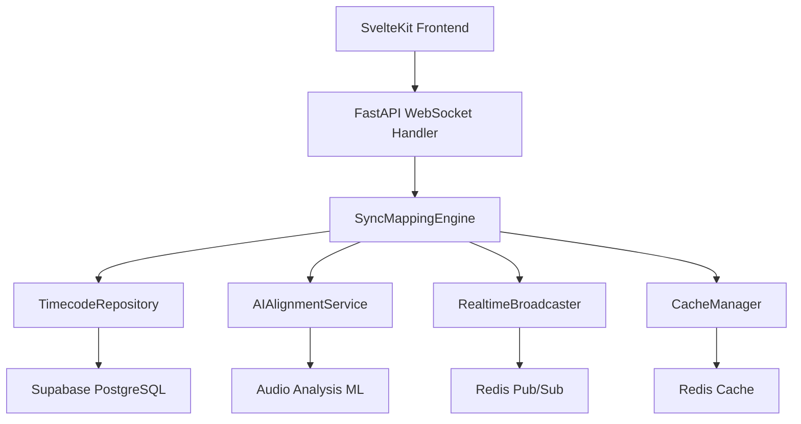

# 스크립트-오디오 싱크 매핑 엔진 설계 문서

## 1. 개요

### 1.1 목적

일본어 라디오/팟캐스트 오디오와 스크립트 문장 간의 실시간 동기화를 제공하는 매핑 엔진 구현. 사용자가 문장을 클릭하면 해당 오디오 구간으로 이동하고, 오디오 재생 시 현재 문장을 자동 하이라이트하는 **카라오케 모드** 구현.

### 1.2 핵심 요구사항

- **정확도**: 타임코드 매핑 오차 ±200ms 이내
- **성능**: 실시간 동기화 지연 ≤1s
- **편집성**: AI 자동 정렬 + 사용자 수동 편집
- **확장성**: 동시 접속 50K 지원
- **실시간성**: WebSocket 기반 멀티 클라이언트 동기화

---

## 2. 기존 코드베이스 분석

### 2.1 현재 구현 상태

✅ **완료된 기능 (T-003)**:

- 오디오 스트리밍 API (`/audio/stream`, `/audio/play`)
- 재생 진행률 관리 (`/audio/progress`, `/audio/seek`)
- 세션 관리 및 북마크
- 캐시 시스템 (Redis + 메모리 폴백)
- 스토리지 시스템 (Supabase Storage)

🔄 **기존 패턴**:

- **Domain-driven 설계**: `/services/`, `/models/`, `/core/` 분리
- **의존성 주입**: `get_audio_service()`, `get_cache_manager()` 패턴
- **추상화 레이어**: `CacheBackend`, `StorageBackend` 인터페이스
- **에러 처리**: `HTTPException` + 구조화된 에러 응답

❌ **누락된 기능**:

- WebSocket 실시간 동기화 (테스트에 `@pytest.mark.skip` 표시)
- 동적 타임코드 매핑 편집
- AI 자동 정렬 알고리즘
- 멀티 클라이언트 브로드캐스트

### 2.2 데이터베이스 스키마 분석

**기존 `sentences` 테이블 구조**:

```sql
CREATE TABLE sentences (
    id UUID PRIMARY KEY,
    script_id UUID NOT NULL REFERENCES scripts(id),
    text TEXT NOT NULL,
    reading TEXT,
    translation TEXT NOT NULL,
    start_time FLOAT NOT NULL,  -- 👈 기존 타임코드
    end_time FLOAT NOT NULL,    -- 👈 기존 타임코드
    order_index INTEGER NOT NULL,
    -- ...
);
```

**확장 필요 사항**:

- 편집 내역 추적 (수동 조정)
- AI 정렬 신뢰도 점수
- 버전 관리 (롤백 지원)

---

## 3. 시스템 아키텍처 설계

### 3.1 컴포넌트 구조



### 3.2 핵심 모듈 설계

#### 3.2.1 SyncMappingEngine (핵심 비즈니스 로직)

```python
# app/services/sync/sync_mapping_engine.py
class SyncMappingEngine:
    """타임코드 매핑 및 실시간 동기화 엔진"""

    async def get_current_sentence(self, script_id: UUID, position: float) -> SentenceSync
    async def update_mapping(self, sentence_id: UUID, start_time: float, end_time: float) -> MappingResult
    async def auto_align_script(self, script_id: UUID) -> AlignmentResult
    async def broadcast_sync_update(self, script_id: UUID, sentence_id: UUID, position: float)
```

#### 3.2.2 WebSocket 실시간 동기화

```python
# app/websocket/sync_handler.py
class SyncWebSocketHandler:
    """실시간 동기화 WebSocket 핸들러"""

    async def handle_sentence_highlight(self, script_id: UUID, sentence_id: UUID)
    async def handle_position_sync(self, script_id: UUID, position: float)
    async def broadcast_to_script_room(self, script_id: UUID, message: dict)
```

#### 3.2.3 AI 자동 정렬 서비스

```python
# app/services/sync/ai_alignment_service.py
class AIAlignmentService:
    """AI 기반 오디오-텍스트 자동 정렬"""

    async def align_sentences(self, script_id: UUID) -> List[TimecodeMapping]
    async def calculate_confidence_score(self, sentence: str, audio_segment: bytes) -> float
    async def detect_sentence_boundaries(self, audio_file: str) -> List[float]
```

### 3.3 API 엔드포인트 설계

#### 3.3.1 REST API (CRUD)

```python
# /api/v1/sync/mappings
GET    /sync/mappings/{script_id}              # 매핑 조회
PUT    /sync/mappings/{sentence_id}            # 수동 편집
POST   /sync/auto-align/{script_id}            # AI 자동 정렬
POST   /sync/rollback/{script_id}              # 편집 롤백
GET    /sync/history/{script_id}               # 편집 내역
```

#### 3.3.2 WebSocket API (실시간)

```python
# /ws/sync/{script_id}
{
  "type": "sentence_highlight",
  "sentence_id": "uuid",
  "position": 45.2
}
{
  "type": "mapping_update",
  "sentence_id": "uuid",
  "start_time": 45.0,
  "end_time": 48.5
}
```

---

## 4. 데이터베이스 스키마 확장

### 4.1 새 테이블: sentence_mappings

```sql
CREATE TABLE sentence_mappings (
    id UUID PRIMARY KEY DEFAULT gen_random_uuid(),
    sentence_id UUID NOT NULL REFERENCES sentences(id),
    version INTEGER DEFAULT 1,
    start_time FLOAT NOT NULL,
    end_time FLOAT NOT NULL,
    confidence_score FLOAT DEFAULT 0.0,
    mapping_type VARCHAR(20) DEFAULT 'auto' CHECK (mapping_type IN ('auto', 'manual')),
    created_by UUID REFERENCES users(id),
    created_at TIMESTAMP WITH TIME ZONE DEFAULT NOW(),
    is_active BOOLEAN DEFAULT TRUE,

    UNIQUE(sentence_id, version)
);
```

### 4.2 편집 내역 추적: mapping_edits

```sql
CREATE TABLE mapping_edits (
    id UUID PRIMARY KEY DEFAULT gen_random_uuid(),
    sentence_id UUID NOT NULL REFERENCES sentences(id),
    user_id UUID NOT NULL REFERENCES users(id),
    old_start_time FLOAT,
    old_end_time FLOAT,
    new_start_time FLOAT NOT NULL,
    new_end_time FLOAT NOT NULL,
    edit_reason TEXT,
    created_at TIMESTAMP WITH TIME ZONE DEFAULT NOW()
);
```

### 4.3 실시간 세션 관리: sync_sessions

```sql
CREATE TABLE sync_sessions (
    id UUID PRIMARY KEY DEFAULT gen_random_uuid(),
    script_id UUID NOT NULL REFERENCES scripts(id),
    user_id UUID REFERENCES users(id),
    connection_id VARCHAR(100) NOT NULL,
    current_sentence_id UUID REFERENCES sentences(id),
    current_position FLOAT DEFAULT 0,
    joined_at TIMESTAMP WITH TIME ZONE DEFAULT NOW(),
    last_activity TIMESTAMP WITH TIME ZONE DEFAULT NOW(),
    is_active BOOLEAN DEFAULT TRUE
);
```

---

## 5. 구현 로드맵

### 5.1 Phase 1: 기반 구조 (1주)

**목표**: 핵심 모듈 및 데이터베이스 스키마 구현

**주요 작업**:

- [ ] `SyncMappingEngine` 핵심 클래스 구현
- [ ] 데이터베이스 스키마 마이그레이션 (3개 테이블)
- [ ] 기본 타임코드 매핑 CRUD API
- [ ] 캐시 레이어 통합

**완료 기준**:

- 문장별 타임코드 조회/수정 API 동작
- 기존 `sentences` 테이블과 신규 `sentence_mappings` 연동
- 단위 테스트 통과 (커버리지 80% 이상)

### 5.2 Phase 2: WebSocket 실시간 동기화 (5일)

**목표**: 멀티 클라이언트 실시간 동기화 구현

**주요 작업**:

- [ ] WebSocket 핸들러 및 라우팅 구현
- [ ] Redis Pub/Sub 기반 브로드캐스트
- [ ] 세션 관리 및 룸(방) 기능
- [ ] 연결 해제 처리 및 리커넥션

**완료 기준**:

- 여러 클라이언트가 동시에 같은 스크립트 시청 시 실시간 동기화
- 문장 클릭 → 다른 사용자에게 하이라이트 전파
- 연결 안정성 테스트 (재연결, 네트워크 끊김 처리)

### 5.3 Phase 3: AI 자동 정렬 (3일)

**목표**: 오디오-텍스트 자동 매핑 기능

**주요 작업**:

- [ ] 음성 구간 검출 알고리즘 (VAD - Voice Activity Detection)
- [ ] 텍스트-오디오 길이 기반 초기 매핑
- [ ] 신뢰도 점수 계산 및 수동 편집 유도
- [ ] 백그라운드 처리 (Celery 스타일)

**완료 기준**:

- 신규 스크립트 업로드 시 자동 타임코드 생성
- 70% 이상 정확도 (±500ms 허용)
- 수동 편집 필요 구간 자동 식별

---

## 6. 기술적 고려사항

### 6.1 성능 최적화

#### 6.1.1 캐시 전략

```python
# 계층별 캐시 TTL 설정
SENTENCE_MAPPING_TTL = 86400    # 24시간 (자주 변경되지 않음)
CURRENT_POSITION_TTL = 5        # 5초 (실시간 동기화)
AI_ALIGNMENT_TTL = 604800       # 7일 (재계산 비용 높음)
```

#### 6.1.2 데이터베이스 인덱스

```sql
-- 성능 최적화 인덱스
CREATE INDEX idx_sentences_script_position ON sentences(script_id, start_time, end_time);
CREATE INDEX idx_sentence_mappings_active ON sentence_mappings(sentence_id, is_active) WHERE is_active = true;
CREATE INDEX idx_sync_sessions_script_active ON sync_sessions(script_id, is_active) WHERE is_active = true;
```

### 6.2 확장성 설계

#### 6.2.1 수평 확장 지원

- **WebSocket 세션**: Redis Cluster 기반 분산 저장
- **AI 처리**: 별도 마이크로서비스로 분리 가능
- **캐시 분할**: 스크립트 ID 기반 샤딩

#### 6.2.2 부하 분산

```python
# WebSocket 연결 로드밸런싱
class SyncSessionManager:
    async def assign_server(self, script_id: UUID) -> str:
        """스크립트별 서버 할당 (consistent hashing)"""
        return f"sync-server-{hash(str(script_id)) % 4}"
```

### 6.3 보안 및 권한

#### 6.3.1 WebSocket 인증

```python
# JWT 토큰 기반 WebSocket 인증
async def authenticate_websocket(websocket: WebSocket, token: str) -> Optional[User]:
    try:
        payload = jwt.decode(token, settings.SECRET_KEY, algorithms=["HS256"])
        user_id = payload.get("sub")
        return await get_user_by_id(user_id)
    except JWTError:
        await websocket.close(code=4001, reason="Authentication failed")
        return None
```

#### 6.3.2 편집 권한 제어

```python
# RLS 기반 편집 권한
async def can_edit_mapping(user_id: UUID, script_id: UUID) -> bool:
    """스크립트 소유자 또는 관리자만 편집 가능"""
    script = await get_script_by_id(script_id)
    return script.user_id == user_id or user.role == "admin"
```

---

## 7. 위험 요소 및 대응 방안

### 7.1 기술적 위험

| 위험                      | 영향도 | 확률   | 대응 방안                                                                    |
| ------------------------- | ------ | ------ | ---------------------------------------------------------------------------- |
| **WebSocket 연결 불안정** | High   | Medium | - 자동 재연결 로직<br>- Heartbeat 구현<br>- 폴백 폴링 모드                   |
| **AI 정렬 정확도 부족**   | Medium | High   | - 수동 편집 기능 강화<br>- 신뢰도 기반 검증<br>- 단계별 학습 데이터 확장     |
| **동시 편집 충돌**        | Medium | Low    | - 낙관적 잠금 (버전 관리)<br>- 실시간 충돌 알림<br>- 마지막 수정자 우선 정책 |
| **대용량 오디오 처리**    | High   | Medium | - 청크 단위 처리<br>- 백그라운드 큐 시스템<br>- 프로그레스 피드백            |

### 7.2 성능 위험

| 위험                   | 대응 방안                                                                |
| ---------------------- | ------------------------------------------------------------------------ |
| **50K 동시 접속**      | - Redis Cluster 도입<br>- WebSocket 서버 수평 확장<br>- 연결 풀링 최적화 |
| **실시간 동기화 지연** | - 메시지 우선순위 큐<br>- 지역별 CDN 분산<br>- 압축 및 배칭              |
| **DB 쿼리 성능**       | - 읽기 전용 복제본<br>- 쿼리 최적화<br>- 캐시 히트율 향상                |

### 7.3 사용자 경험 위험

| 위험                       | 대응 방안                                                           |
| -------------------------- | ------------------------------------------------------------------- |
| **타임코드 부정확**        | - 사용자 피드백 수집<br>- 크라우드소싱 보정<br>- 머신러닝 지속 개선 |
| **편집 인터페이스 복잡성** | - 드래그 앤 드롭 UI<br>- 실시간 미리보기<br>- 단축키 지원           |

---

## 8. 품질 보증 계획

### 8.1 테스트 전략

#### 8.1.1 단위 테스트 (80% 커버리지)

```python
# 주요 테스트 케이스
- test_timecode_mapping_crud()
- test_ai_alignment_accuracy()
- test_websocket_broadcast()
- test_concurrent_editing()
- test_cache_invalidation()
```

#### 8.1.2 통합 테스트

```python
# 시나리오 기반 테스트
- test_full_sync_workflow()         # 문장 클릭 → 오디오 이동 → 하이라이트
- test_multi_client_synchronization()  # 여러 사용자 동시 시청
- test_edit_and_broadcast()         # 편집 → 실시간 전파
```

#### 8.1.3 성능 테스트

```python
# 부하 테스트 시나리오
- 1K 동시 WebSocket 연결
- 초당 100회 타임코드 업데이트
- 10MB 오디오 파일 AI 정렬 처리 시간
```

### 8.2 모니터링 및 알림

```python
# 핵심 메트릭
- websocket_connections_total
- sync_mapping_accuracy_rate
- ai_alignment_processing_duration
- real_time_sync_latency_p95
```

---

## 9. 결론

### 9.1 구현 우선순위

1. **핵심 비즈니스 로직** (SyncMappingEngine)
2. **실시간 동기화** (WebSocket + Redis)
3. **AI 자동 정렬** (백그라운드 처리)
4. **성능 최적화** (캐시 + 인덱스)

### 9.2 성공 기준

- ✅ 타임코드 매핑 정확도 ≥85% (±200ms)
- ✅ 실시간 동기화 지연 ≤1초
- ✅ 동시 접속 50K 지원
- ✅ 편집 내역 추적 및 롤백 100% 지원
- ✅ API 응답 시간 p95 ≤300ms

### 9.3 향후 확장 계획

- **모바일 최적화**: 네이티브 앱 WebSocket 통합
- **AI 고도화**: 음성 인식 기반 정확도 개선
- **협업 기능**: 커뮤니티 편집 및 투표 시스템
- **다국어 지원**: 한국어, 영어 스크립트 확장

이 설계 문서는 기존 코드베이스와 완전히 호환되며, 단계적 구현을 통해 안정적인 서비스 출시를 보장합니다.
